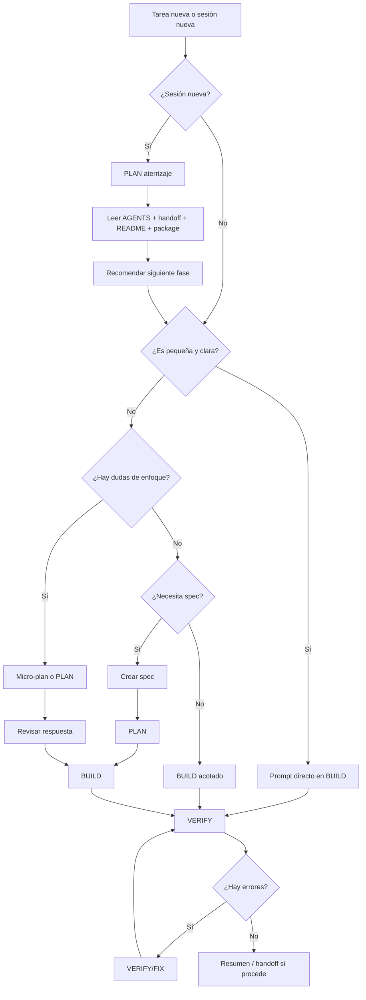

# Guía de trabajo con OpenCode

> [!NOTE]
> [GitHub Repo](https://github.com/Spanioulis/Session-work-guide/blob/main/GUIA_TRABAJO_OPENCODE.md)

Esta guía define una forma práctica de trabajar con **OpenCode** en proyectos de desarrollo.

La idea principal es trabajar de forma controlada, por fases y con tareas pequeñas, evitando pedirle al agente cambios demasiado amplios o poco definidos.

El objetivo no es usar siempre el mismo flujo para todo, sino elegir la forma de trabajo adecuada según el tipo de tarea.

---

## 1. Principio general

La forma de trabajo base es:

```txt
EXPLORE → PLAN → BUILD → VERIFY
```

Pero no todas las tareas necesitan pasar por todas las fases.

La regla principal es:

```txt
No todo necesita spec.
No todo necesita plan.
Pero todo necesita alcance claro.
```

OpenCode debe usarse como un agente de trabajo por fases:

```txt
Entender
  ↓
Planificar si hace falta
  ↓
Ejecutar con alcance claro
  ↓
Verificar
  ↓
Documentar si procede
```

---

## 2. Fases de trabajo

## <font color="#F97316">🔍 EXPLORE</font>

Se usa para entender el proyecto o una parte concreta **sin modificar archivos**.

Usar cuando:

```txt
- Empiezas en un proyecto nuevo.
- Hay que entender una arquitectura existente.
- No sabes qué archivos están implicados.
- Hay un bug y primero quieres diagnóstico.
- Hay riesgo de tocar más de la cuenta.
```

**Modelo recomendado:** DeepSeek V4 Pro o GPT-5.5. Reserva GPT-5.5 para bugs delicados o arquitectura compleja.

Ejemplo:

```txt
Explora el proyecto sin modificar archivos.

Objetivo:
Entender cómo está organizada la home y qué archivos habría que tocar para añadir una nueva sección.

No hagas cambios todavía.

Devuélveme:
- Archivos relevantes.
- Cómo está estructurada la sección actual.
- Riesgos detectados.
- Propuesta breve de ejecución.
```

---

## <font color="#3B82F6">📋 PLAN</font>

Se usa para pedir un plan, aterrizar contexto o decidir el siguiente paso **antes de ejecutar cambios**.

Usar cuando:

```txt
- Estás empezando una sesión nueva.
- Quieres aterrizar el estado actual del proyecto.
- La tarea tiene varias partes.
- Puede afectar a varios archivos.
- Hay decisiones técnicas.
- Hay dudas sobre el enfoque.
- Quieres validar antes de que toque código.
```

**Modelo recomendado:** DeepSeek V4 Pro o GPT-5.5. Usa GPT-5.5 si el plan implica decisiones arquitectónicas, accesibilidad importante, SEO técnico o bugs delicados.

Ejemplo:

```txt
Crea un plan para implementar esta feature.

No modifiques archivos todavía.

Objetivo:
Crear una página de detalle para proyectos.

El plan debe incluir:
- Archivos que tocarías.
- Orden de ejecución.
- Riesgos.
- Verificaciones.
- Qué no debe hacerse todavía.
```

---

## <font color="#2563EB">🔨 BUILD</font>

Se usa para ejecutar cambios.

Usar cuando:

```txt
- El alcance ya está claro.
- La tarea está definida.
- Hay una spec aprobada.
- Hay un plan aprobado.
- Es un cambio pequeño y no hace falta plan.
```

**Modelo recomendado:** GLM-5.1 para código normal. GPT-5.5 para código delicado. DeepSeek V4 Pro para documentación, guías o cambios mínimos.

Ejemplo:

```txt
Ejecuta únicamente esta tarea.

No avances otras tareas.
No cambies arquitectura.
No añadas dependencias salvo que sea imprescindible.

Al terminar, muestra:
- Archivos modificados.
- Cambios realizados.
- Comandos ejecutados.
- Resultado de build/check si procede.
```

---

## <font color="#10B981">✅ VERIFY</font>

Se usa para revisar, validar o corregir.

Usar cuando:

```txt
- Hay un bug.
- Hay error de consola.
- Hay error de build.
- Algo no funciona tras una tarea.
- Quieres revisar sin avanzar.
- Quieres comprobar SEO, accesibilidad o rendimiento.
```

**Modelo recomendado:** DeepSeek V4 Pro o GPT-5.5. Usa GPT-5.5 para REVIEW crítico, accesibilidad, SEO técnico o bugs delicados.

Ejemplo:

```txt
Revisa y corrige únicamente esta incidencia:

[PEGAR ERROR]

No avances ninguna feature nueva.
No hagas refactors fuera de alcance.

Objetivo:
Diagnosticar y corregir el error con el mínimo cambio necesario.

Al terminar, muestra:
- Causa probable.
- Archivos modificados.
- Comandos ejecutados.
- Resultado de verificaciones.
- Confirmación de si el error desapareció.
```

---

### Regla práctica de modelos

La idea no es usar siempre el modelo más potente, sino reservarlo para las fases donde aporta más valor:

```txt
Documentación / guías / specs / AGENTS → DeepSeek V4 Pro suele ser suficiente.
Aterrizaje de sesión → DeepSeek V4 Pro o GPT-5.5.
Código normal → PLAN con GPT-5.5 o DeepSeek V4 Pro, BUILD con GLM-5.1.
Código delicado → GPT-5.5 en PLAN y REVIEW.
Cambios mínimos → BUILD directo con GLM-5.1 o DeepSeek V4 Pro.
```

---

## 3. Diferencia entre AGENTS, SKILLS y SPECS

Es importante distinguir estos conceptos.

```txt
AGENTS
├── Reglas generales de comportamiento
├── Indican cómo debe trabajar OpenCode
└── Aplican durante todo el proyecto

SKILLS
├── Capacidades especializadas
├── Aportan criterio técnico
└── Se aplican cuando la tarea lo necesita

SPECS
├── Tareas concretas
├── Definen qué hay que hacer ahora
└── Se ejecutan una a una
```

Resumen rápido:

```txt
AGENTS = cómo debe trabajar el agente.
SKILLS = qué criterio especializado debe aplicar.
SPECS = qué tarea concreta debe ejecutar.
```

Ejemplo:

```txt
AGENTS:
- No avanzar a la siguiente tarea sin permiso.
- No añadir dependencias innecesarias.
- Actualizar handoff si procede.

SKILLS:
- Accesibilidad.
- SEO.
- Performance.
- Astro.
- WordPress.
- Tailwind.

SPECS:
- Crear Hero.
- Crear página de proyectos.
- Añadir página /repos/.
- Corregir bug de rutas.
```

---

## 4. Uso de `AGENTS.md` en OpenCode

`AGENTS.md` es la regla base del proyecto para el agente. No es una spec ni una tarea: define cómo debe comportarse OpenCode en ese repositorio.

```txt
README.md  → para entender el proyecto.
AGENTS.md  → para saber cómo debe trabajar el agente.
```

### Cuándo leerlo completo

| Situación                                                                       | Acción                                          |
| ------------------------------------------------------------------------------- | ----------------------------------------------- |
| Sesión nueva                                                                    | Leer AGENTS.md + handoff + spec actual          |
| Cambio de modelo                                                                | Releer AGENTS.md                                |
| Vuelta tras pausa larga                                                         | Releer AGENTS.md                                |
| Cambios delicados (arquitectura, dependencias, rutas, SEO global, build/deploy) | Releer AGENTS.md + handoff + archivos afectados |

### Cuándo basta con "sigue AGENTS.md"

En la misma sesión, mismo modelo, tareas pequeñas encadenadas:

```txt
Sigue las reglas de AGENTS.md y ejecuta únicamente esta tarea.
```

### Orden de lectura recomendado

```txt
AGENTS.md → docs/handoff.md → spec actual
```

Con más documentación:

```txt
AGENTS.md → docs/handoff.md → docs/project-context.md → spec actual
```

---

## 5. Cuándo usar spec y cuándo pedir <font color="#3B82F6">📋 PLAN</font>

No todo necesita spec. No todo necesita plan. Pero todo necesita alcance claro.

| Situación                                             | ¿Spec?   | ¿<font color="#3B82F6">📋 PLAN</font>? | Flujo                                                                                                                                                           |
| ----------------------------------------------------- | -------- | -------------------------------------- | --------------------------------------------------------------------------------------------------------------------------------------------------------------- |
| Cambio pequeño y claro (texto, imagen, estilo, botón) | No       | No                                     | Prompt directo                                                                                                                                                  |
| Cambio pequeño con dudas de enfoque                   | No       | Micro-plan                             | Micro-plan → <font color="#2563EB">🔨 BUILD</font>                                                                                                              |
| Varios archivos, rutas, datos o arquitectura          | Sí       | Sí                                     | Spec → <font color="#3B82F6">📋 Plan</font> → <font color="#2563EB">🔨 Build</font>                                                                             |
| Bug simple                                            | No       | No                                     | <font color="#10B981"><font color="#10B981">✅ VERIFY</font>/FIX</font>                                                                                         |
| Bug delicado                                          | Opcional | Sí                                     | <font color="#F97316">🔍 EXPLORE</font> → <font color="#3B82F6">📋 Plan</font> → <font color="#10B981">✅ Fix</font>                                            |
| Migración o refactor grande                           | Sí       | Sí                                     | <font color="#F97316">🔍 EXPLORE</font> → <font color="#3B82F6">📋 Plan</font> → <font color="#2563EB">🔨 Build</font> → <font color="#10B981">✅ VERIFY</font> |

**No hace falta spec** si el cambio es pequeño, afecta a pocos archivos, no cambia arquitectura, no añade dependencias, no crea rutas y se puede verificar rápido. Ejemplos: cambiar un texto, añadir una imagen, ajustar un estilo, corregir un alt, cambiar un enlace, añadir un botón.

**Sí conviene spec** si la tarea afecta a varios archivos, crea componentes reutilizables, páginas o rutas nuevas, usa datos dinámicos, afecta a SEO de forma importante, o necesitas continuar en otra sesión. Ejemplos: crear sistema de proyectos, página de detalle, sección reutilizable compleja, integración con CMS/API.

**No hace falta <font color="#3B82F6">📋 PLAN</font>** si la tarea es pequeña, el objetivo está claro, el alcance está cerrado y no hay decisiones técnicas relevantes.

**Sí conviene <font color="#3B82F6">📋 PLAN</font>** si estás aterrizando en una sesión nueva, hay varias formas de hacerlo, no sabes qué archivos tocar, puede afectar a arquitectura, o quieres revisar antes de ejecutar.

---

## 6. Niveles de tarea

### Nivel 0 — Aterrizaje de sesión

Sirve para empezar una sesión nueva de OpenCode sin tocar código.

No ejecuta specs.

No modifica archivos.

No lee todas las specs.

Objetivo:

```txt
Aterrizar en el estado actual del proyecto antes de decidir el siguiente paso.
```

Flujo:

<font color="#3B82F6">📋 PLAN</font> aterrizaje  
&nbsp;&nbsp;↓  
Leer contexto mínimo  
&nbsp;&nbsp;↓  
Detectar estado actual  
&nbsp;&nbsp;↓  
Recomendar siguiente fase

Usar cuando:

```txt
- Empiezas una sesión nueva.
- Vuelves al proyecto tras una pausa.
- Cambias de modelo.
- No sabes exactamente en qué punto quedó el proyecto.
- Quieres evitar que el agente lea todo o avance specs.
```

---

### Nivel 1 — Cambio pequeño

No necesita spec ni plan.

Prompt directo  
&nbsp;&nbsp;↓  
<font color="#2563EB">🔨 BUILD</font>  
&nbsp;&nbsp;↓  
Resumen final

Ejemplos:

```txt
- Cambiar texto.
- Añadir botón.
- Añadir imagen.
- Ajustar clase CSS.
- Añadir sección simple.
```

---

### Nivel 2 — Cambio pequeño con dudas

No necesita spec, pero puede usar micro-plan.

Micro-plan  
&nbsp;&nbsp;↓  
<font color="#2563EB">🔨 BUILD</font>  
&nbsp;&nbsp;↓  
Verificación

Ejemplos:

```txt
- Añadir una sección pero no sabes si crear componente.
- Modificar una parte visual con varios archivos posibles.
- Ajustar responsive de un bloque existente.
```

---

### Nivel 3 — Feature importante

Conviene usar spec y plan.

SPEC  
&nbsp;&nbsp;↓  
<font color="#3B82F6">📋 PLAN</font>  
&nbsp;&nbsp;↓  
<font color="#2563EB">🔨 BUILD</font>  
&nbsp;&nbsp;↓  
<font color="#10B981">✅ VERIFY</font>

Ejemplos:

```txt
- Nueva página.
- Nuevo sistema de datos.
- Nueva ruta.
- Componente reutilizable importante.
- Integración con contenido dinámico.
```

---

### Nivel 4 — Bug delicado, arquitectura o migración

Usar fases completas.

<font color="#F97316">🔍 EXPLORE</font>  
&nbsp;&nbsp;↓  
<font color="#3B82F6">📋 PLAN</font>  
&nbsp;&nbsp;↓  
<font color="#2563EB"><font color="#2563EB">🔨 BUILD</font>/FIX</font>  
&nbsp;&nbsp;↓  
<font color="#10B981">✅ VERIFY</font>

Ejemplos:

```txt
- Error de build.
- Error de consola persistente.
- Migración.
- Refactor grande.
- Problema de rutas.
- Problema con dependencias.
```

---

## 7. Cómo dar contexto sin saturar al agente

OpenCode funciona mejor cuando recibe el contexto justo, no cuando lee todo el repositorio.

```txt
Da solo los archivos necesarios para la fase actual.
No leas todas las specs por defecto.
Usa EXPLORE si no sabes qué archivos son relevantes.
Usa AGENTS.md + handoff + spec actual como contexto base.
```

Reglas por fase:

| Fase                                          | Contexto mínimo                                               |
| --------------------------------------------- | ------------------------------------------------------------- |
| Aterrizaje                                    | AGENTS.md + handoff + README + package.json                   |
| <font color="#2563EB">🔨 BUILD</font> de spec | AGENTS.md + handoff + spec actual                             |
| <font color="#2563EB">🔨 BUILD</font> pequeño | AGENTS.md + archivos implicados                               |
| <font color="#10B981">✅ VERIFY</font>        | AGENTS.md + archivos del error + handoff                      |
| No sabes qué tocar                            | <font color="#F97316">🔍 EXPLORE</font> en lugar de leer todo |

---

# 8. Plantillas de prompts

## 8.0. Bloque común de reglas para BUILD

Estas reglas aplican **solo a plantillas de ejecución** (<font color="#2563EB">🔨 BUILD</font>). No las uses en fases de PLAN o REVIEW. Se incluyen aquí para evitar repetirlas en cada plantilla BUILD:

```txt
Alcance:
- Modifica solo los archivos necesarios.
- Reutiliza la estructura y estilos existentes.
- No añadas dependencias salvo que sea imprescindible y lo justifiques.
- No cambies arquitectura salvo que sea necesario y lo expliques antes.
- No avances otras tareas.
- Mantén HTML semántico y responsive.
- Revisa accesibilidad básica: alt correcto, heading coherente y foco si aplica.

Al terminar, muestra:
- Archivos modificados.
- Cambios realizados.
- Comandos ejecutados.
- Resultado de build/check si procede.
```

Las plantillas que usan este bloque lo indican con: **Aplica el bloque común de reglas (8.0).**

---

## 8.1. Plantilla de aterrizaje de sesión nueva

Usar al abrir una sesión nueva de OpenCode y querer entender el estado actual antes de ejecutar cambios.

No debe modificar archivos.

No debe ejecutar specs.

No debe leer todas las specs.

**Fase:** <font color="#3B82F6">📋 PLAN</font> | **Modelo:** DeepSeek V4 Pro / GPT-5.5

Prompt para copiar y pegar:

```txt
Estoy empezando una sesión nueva del proyecto [NOMBRE_PROYECTO].

Objetivo:
Aterrizar en el estado actual del proyecto antes de ejecutar cambios.

Lee solo:

- AGENTS.md
- docs/handoff.md
- README.md
- package.json

No modifiques archivos.
No ejecutes ninguna spec.
No avances tareas.
No leas todas las specs.

Devuélveme:

1. Estado actual del proyecto.
2. Stack detectado.
3. Última situación registrada en docs/handoff.md.
4. Incidencias pendientes, si las hay.
5. Próximo paso recomendado.
6. Fase recomendada para ese siguiente paso: EXPLORE, PLAN, BUILD o VERIFY.
7. Comandos mínimos que convendría ejecutar antes de tocar código.
```

Ejemplo aplicado:

```txt
Estoy empezando una sesión nueva del proyecto Portfolio 3.0 — Spanioulis.

Objetivo:
Aterrizar en el estado actual del proyecto antes de ejecutar cambios.

Lee solo:

- AGENTS.md
- docs/handoff.md
- README.md
- package.json

No modifiques archivos.
No ejecutes ninguna spec.
No avances tareas.
No leas todas las specs.

Devuélveme:

1. Estado actual del proyecto.
2. Stack detectado.
3. Última situación registrada en docs/handoff.md.
4. Incidencias pendientes, si las hay.
5. Próximo paso recomendado.
6. Fase recomendada para ese siguiente paso: EXPLORE, PLAN, BUILD o VERIFY.
7. Comandos mínimos que convendría ejecutar antes de tocar código.
```

---

## 8.2. Plantilla para cambio pequeño sin spec

Usar cuando la tarea sea pequeña, localizada y no requiera una spec formal.

**Fase:** <font color="#2563EB">🔨 BUILD</font> | **Modelo:** GLM-5.1 / DeepSeek V4 Pro

Prompt para copiar y pegar:

```txt
Añade una mejora pequeña y localizada siguiendo estas reglas.

Alcance:
- Modifica solo los archivos necesarios.
- Reutiliza la estructura y estilos existentes.
- No añadas dependencias.
- No cambies arquitectura.
- No avances otras tareas.
- Mantén HTML semántico y responsive.
- Revisa accesibilidad básica: alt correcto, heading coherente y foco si aplica.

Al terminar, muestra:
- Archivos modificados.
- Cambios realizados.
- Comandos ejecutados.
- Resultado de build/check si procede.

Objetivo concreto:
[AQUÍ EL OBJETIVO]
```

Ejemplo aplicado:

```txt
Añade una mejora pequeña y localizada siguiendo estas reglas.

Alcance:
- Modifica solo los archivos necesarios.
- Reutiliza la estructura y estilos existentes.
- No añadas dependencias.
- No cambies arquitectura.
- No avances otras tareas.
- Mantén HTML semántico y responsive.
- Revisa accesibilidad básica: alt correcto, heading coherente y foco si aplica.

Al terminar, muestra:
- Archivos modificados.
- Cambios realizados.
- Comandos ejecutados.
- Resultado de build/check si procede.

Objetivo concreto:
Añade una sección simple con título e imagen en la home.
```

---

## 8.3. Plantilla para cambio pequeño con micro-plan

Usar cuando el cambio parece pequeño, pero quieres que OpenCode piense antes de tocar archivos.

**Fase:** <font color="#3B82F6">📋 PLAN</font> | **Modelo:** DeepSeek V4 Pro / GPT-5.5

Prompt para copiar y pegar:

```txt
Quiero hacer una mejora pequeña y localizada.

Antes de modificar archivos, dime brevemente:
- Qué archivos tocarías.
- Si crearías componente nuevo o reutilizarías uno existente.
- Riesgos mínimos.
- Si ves necesario crear una spec formal o no.

No ejecutes cambios todavía.
Devuélveme el micro-plan y espera confirmación antes de modificar archivos.

Objetivo concreto:
[AQUÍ EL OBJETIVO]
```

Ejemplo aplicado:

```txt
Quiero hacer una mejora pequeña y localizada.

Antes de modificar archivos, dime brevemente:
- Qué archivos tocarías.
- Si crearías componente nuevo o reutilizarías uno existente.
- Riesgos mínimos.
- Si ves necesario crear una spec formal o no.

No ejecutes cambios todavía.
Devuélveme el micro-plan y espera confirmación antes de modificar archivos.

Objetivo concreto:
Añade una sección simple con título e imagen en la home.
```

---

## 8.4. Plantilla para pedir <font color="#3B82F6">📋 PLAN</font>

Usar cuando quieres revisar el enfoque antes de ejecutar.

**Fase:** <font color="#3B82F6">📋 PLAN</font> | **Modelo:** DeepSeek V4 Pro / GPT-5.5

Prompt para copiar y pegar:

```txt
Crea un plan para esta tarea.

No modifiques archivos todavía.

Objetivo:
[AQUÍ EL OBJETIVO]

El plan debe incluir:
- Archivos que tocarías.
- Orden de ejecución.
- Riesgos.
- Verificaciones necesarias.
- Qué no debe hacerse todavía.
- Si ves necesario crear una spec formal.

No ejecutes cambios.
```

---

## 8.5. Plantilla para ejecutar un <font color="#3B82F6">📋 PLAN</font> aprobado

Usar cuando OpenCode ya ha creado un plan y tú lo has revisado.

**Fase:** <font color="#2563EB">🔨 BUILD</font> | **Modelo:** GLM-5.1 / GPT-5.5

Prompt para copiar y pegar:

```txt
Sí, apruebo el plan. Ejecuta los cambios siguiendo exactamente este alcance:

[PEGAR AQUÍ EL PLAN APROBADO O SUS TAREAS]

Aplica el bloque común de reglas (8.0) y además:
- No amplíes el alcance.
- Si aparece un problema que obliga a cambiar el plan, para y explica la situación antes de seguir.

Al terminar, muestra también:
- Problemas encontrados.
- Estado final.
- Próximo paso recomendado.
```

---

## 8.6. Plantilla para ejecutar una spec

Usar cuando la tarea ya está definida en una spec.

**Fase:** <font color="#2563EB">🔨 BUILD</font> | **Modelo:** GLM-5.1 / GPT-5.5

Prompt para copiar y pegar:

```txt
Ejecuta únicamente la spec:

specs/XXX-nombre.md

Antes de tocar nada, lee:
- AGENTS.md
- docs/handoff.md
- la spec indicada

Aplica el bloque común de reglas (8.0).

No avances a la siguiente spec.
No amplíes el alcance.

Al terminar, actualiza la spec si procede y muestra también:
- Problemas encontrados.
- Estado final de la spec.
- Próxima spec recomendada.
```

Versión con más contexto (documentación adicional):

```txt
Ejecuta únicamente la spec:

specs/XXX-nombre.md

Antes de tocar nada, lee:
- AGENTS.md
- docs/handoff.md
- docs/project-context.md
- specs/XXX-nombre.md

Aplica el bloque común de reglas (8.0).

No avances a la siguiente spec.
No amplíes el alcance.

Al terminar, actualiza docs/handoff.md y la spec, y muestra también:
- Problemas encontrados.
- Estado final de la spec.
- Próxima spec recomendada.
```

---

## 8.7. Plantilla para bug o incidencia

Usar cuando algo falla y no quieres avanzar features.

**Fase:** <font color="#10B981"><font color="#10B981">✅ VERIFY</font>/FIX</font> | **Modelo:** GPT-5.5 / DeepSeek V4 Pro

Prompt para copiar y pegar:

```txt
Revisa y corrige únicamente esta incidencia:

[PEGAR ERROR O DESCRIPCIÓN DEL BUG]

No avances ninguna feature nueva.
No hagas refactors fuera de alcance.
No cambies arquitectura salvo que sea imprescindible y lo justifiques.

Objetivo:
Diagnosticar y corregir el error con el mínimo cambio necesario.

Comprobaciones mínimas:
- Ejecutar los comandos necesarios de diagnóstico.
- Corregir solo lo necesario.
- Ejecutar check/build/dev si procede.
- Verificar la ruta o funcionalidad afectada.

Al terminar, muestra:
- Causa probable.
- Archivos modificados.
- Comandos ejecutados.
- Resultado de verificaciones.
- Confirmación de si el error desapareció.
- Estado final.
```

---

## 8.8. Plantilla para <font color="#10B981">✅ VERIFY</font> sin modificar archivos

Usar cuando solo quieres revisar el estado.

**Fase:** <font color="#10B981">✅ VERIFY</font> | **Modelo:** DeepSeek V4 Pro / GPT-5.5

Prompt para copiar y pegar:

```txt
Verifica el estado actual sin modificar archivos.

Objetivo:
[AQUÍ LO QUE QUIERES COMPROBAR]

No hagas cambios.

Devuélveme:
- Estado actual.
- Archivos relevantes.
- Posibles problemas.
- Verificaciones pendientes.
- Recomendación de siguiente paso.
```

---

## 8.9. Plantilla para aplicar una skill

Usar cuando quieres que OpenCode aplique una skill concreta a una tarea.

**Cuándo usar cada variante:**

| Situación                                                                                               | Variante              |
| ------------------------------------------------------------------------------------------------------- | --------------------- |
| Skill + cambio importante (accesibilidad, SEO, arquitectura, performance, migraciones, varios archivos) | **A — PLAN primero**  |
| Skill + cambio pequeño y cerrado (añadir aria-label, revisar un meta, corregir un alt)                  | **B — BUILD directo** |

---

### A — Variante PLAN primero

**Fase:** <font color="#3B82F6">📋 PLAN</font> | **Modelo:** DeepSeek V4 Pro / GPT-5.5

Prompt para copiar y pegar:

```txt
Lee AGENTS.md y la skill correspondiente.

Lee esta skill como una norma de trabajo, no como una sugerencia.
Aplícala solo cuando sea relevante para esta tarea.
No leas ni apliques otras specs o skills salvo que estén explícitamente relacionadas.

No modifiques archivos.

Objetivo:
Aplicar esta skill a la siguiente tarea:

[AQUÍ LA TAREA CONCRETA]

Explícame:

1. Cómo aplicarías esta skill a la tarea.
2. Qué archivos revisarías.
3. Qué riesgos o puntos críticos ves.
4. Qué criterios usarías para validar que la skill se ha aplicado bien.
5. Qué plan de ejecución propones.

No ejecutes cambios todavía.
```

---

### B — Variante BUILD directo

Usar solo cuando la tarea es pequeña, concreta y el alcance está cerrado.

**Fase:** <font color="#2563EB">🔨 BUILD</font> | **Modelo:** GLM-5.1 / GPT-5.5

Prompt para copiar y pegar:

```txt
Lee AGENTS.md y la skill correspondiente.

Lee esta skill como una norma de trabajo, no como una sugerencia.
No leas ni apliques otras specs o skills.

Aplica solo esta corrección concreta:

[AQUÍ LA TAREA CONCRETA]

No modifiques nada más.
```

---

## 8.10. Plantilla para crear una spec

Usar cuando necesitas definir una tarea formal antes de ejecutar.

**Fase:** <font color="#3B82F6">📋 PLAN</font> | **Modelo:** DeepSeek V4 Pro / GPT-5.5

Prompt para copiar y pegar:

```txt
Crea una spec para esta feature sin modificar código.

Objetivo:
[AQUÍ EL OBJETIVO]

La spec debe incluir:
- Objetivo concreto.
- Alcance detallado.
- Archivos probables.
- Tareas ordenadas.
- Riesgos detectados.
- Verificaciones necesarias.
- Criterios de aceptación.
- Qué no debe hacerse todavía.

Devuélveme la spec lista para guardar en specs/.
No crees el archivo todavía salvo que te lo pida explícitamente.
```

---

## 8.11. Plantilla para REVIEW sin modificar archivos

Usar cuando quieres una revisión tipo code review de los cambios actuales.

**Fase:** <font color="#10B981">✅ VERIFY</font> | **Modelo:** GPT-5.5 / DeepSeek V4 Pro

Prompt para copiar y pegar:

```txt
Revisa los cambios actuales como code review sin modificar archivos.

Revisa el diff actual si procede.

Revisa:
- Bugs introducidos.
- Regresiones.
- Riesgos detectados.
- Tests o checks faltantes.
- Cambios fuera de alcance.
- Problemas de accesibilidad o SEO si aplica.

Devuélveme:
- Lista de hallazgos ordenados por prioridad.
- Recomendación de siguiente paso.
```

---

## 8.12. Plantilla para continuación de sesión o tarea interrumpida

Usar cuando una tarea quedó a medias y necesitas recuperar estado.

**Fase:** <font color="#3B82F6">📋 PLAN</font> | **Modelo:** DeepSeek V4 Pro / GPT-5.5

Prompt para copiar y pegar:

```txt
Recupera el estado de la sesión anterior.

Lee AGENTS.md y docs/handoff.md.

No ejecutes cambios todavía.

Devuélveme:
1. Qué se hizo en la última sesión.
2. Qué queda pendiente.
3. Qué archivos están implicados.
4. Qué verificaciones faltan.
5. Siguiente paso recomendado.
6. Fase recomendada: EXPLORE, PLAN, BUILD o VERIFY.
```

---

## 9. Reglas de control de alcance

Frases útiles para añadir a cualquier prompt:

```txt
No avances a otra tarea.
```

```txt
No hagas cambios fuera de alcance.
```

```txt
No añadas dependencias salvo que sea imprescindible y lo justifiques.
```

```txt
No cambies arquitectura salvo que sea necesario y lo expliques antes.
```

```txt
Si detectas que este cambio no es pequeño, para y propón crear una spec o un plan.
```

```txt
Antes de modificar archivos, dime qué archivos tocarías.
```

```txt
Ejecuta exactamente el plan aprobado.
```

```txt
No marques la tarea como completada si no pasan las verificaciones.
```

```txt
No leas todas las specs.
```

```txt
No ejecutes ninguna spec.
```

```txt
No leas ni apliques otras specs o skills salvo que estén explícitamente relacionadas con esta tarea.
```

### Git

```txt
Revisa el diff actual antes de hacer cambios si procede.
No reviertas cambios ajenos.
No hagas commit salvo petición explícita.
Separa tus cambios de los cambios existentes.
```

### Problemas fuera de alcance

```txt
Si detectas un problema no relacionado con la tarea actual, no lo corrijas directamente.
Repórtalo como follow-up para una tarea futura.
```

---

## 10. Verificaciones

Las verificaciones dependen del proyecto.

Ejemplos habituales:

```bash
pnpm check
pnpm build
pnpm dev
```

En Astro puede ser:

```bash
pnpm astro check
pnpm build
pnpm dev
```

En algunos casos:

```bash
pnpm astro sync
pnpm preview
```

También puede ser necesario revisar:

```txt
- Consola del navegador.
- Responsive.
- SEO básico.
- Accesibilidad básica.
- Rutas afectadas.
- Formularios.
- Imágenes.
```

Regla:

```txt
Una tarea solo se considera cerrada si pasa las verificaciones necesarias.
```

Si no pasan, el estado debe quedar claro:

```txt
- Completada.
- Completada parcialmente.
- Pendiente de fix.
- Bloqueada.
- En revisión.
```

### Tipos de <font color="#10B981">✅ VERIFY</font>

| Tipo                                                                    | Descripción                                     | ¿Modifica archivos? | ¿Ejecuta comandos? |
| ----------------------------------------------------------------------- | ----------------------------------------------- | ------------------- | ------------------ |
| <font color="#10B981">✅ VERIFY</font> lectura                          | Revisar estado, archivos, problemas potenciales | No                  | No                 |
| <font color="#10B981">✅ VERIFY</font> comandos                         | Ejecutar check/build/dev para validar           | No                  | Sí                 |
| <font color="#10B981"><font color="#10B981">✅ VERIFY</font>/FIX</font> | Diagnosticar y corregir con cambios mínimos     | Sí                  | Sí                 |

---

## 11. Tabla rápida de decisión

```txt
¿Estoy empezando una sesión nueva?
├── Sí → PLAN aterrizaje.
└── No → Siguiente pregunta.

¿Es un cambio pequeño y claro?
├── Sí → Prompt directo sin spec.
└── No → Siguiente pregunta.

¿Hay alguna duda sobre archivos o enfoque?
├── Sí → Micro-plan.
└── No → BUILD directo.

¿Toca varios archivos, rutas, datos o arquitectura?
├── Sí → Crear spec.
└── No → Prompt acotado.

¿Hay riesgo de romper algo importante?
├── Sí → PLAN antes de BUILD.
└── No → BUILD.

¿Es un bug?
├── Sí → VERIFY/FIX, no avanzar features.
└── No → Flujo normal.

¿Es migración o refactor grande?
├── Sí → EXPLORE → PLAN → BUILD → VERIFY.
└── No → Elegir nivel según alcance.
```

---

## 12. Tabla de casos

| Caso                   | Spec     | Plan            | Flujo                                                                                                                                                           |
| ---------------------- | -------- | --------------- | --------------------------------------------------------------------------------------------------------------------------------------------------------------- |
| Aterrizar sesión nueva | No       | Sí              | <font color="#3B82F6">📋 PLAN</font> aterrizaje                                                                                                                 |
| Cambiar texto          | No       | No              | Prompt directo                                                                                                                                                  |
| Añadir imagen          | No       | No              | Prompt directo                                                                                                                                                  |
| Añadir sección simple  | No       | No / micro-plan | Prompt directo                                                                                                                                                  |
| Ajuste CSS pequeño     | No       | No              | Prompt directo                                                                                                                                                  |
| Componente pequeño     | Opcional | Micro-plan      | Prompt acotado                                                                                                                                                  |
| Nueva página           | Sí       | Sí              | Spec → <font color="#3B82F6">📋 Plan</font> → <font color="#2563EB">🔨 Build</font>                                                                             |
| Nueva ruta             | Sí       | Sí              | Spec → <font color="#3B82F6">📋 Plan</font> → <font color="#2563EB">🔨 Build</font>                                                                             |
| Sistema de datos       | Sí       | Sí              | <font color="#F97316">🔍 Explore</font> → <font color="#3B82F6">📋 Plan</font> → <font color="#2563EB">🔨 Build</font>                                          |
| Migración              | Sí       | Sí              | <font color="#F97316">🔍 Explore</font> → <font color="#3B82F6">📋 Plan</font> → <font color="#2563EB">🔨 Build</font> → <font color="#10B981">✅ Verify</font> |
| Bug simple             | No       | No              | <font color="#10B981"><font color="#10B981">✅ Verify</font>/Fix</font>                                                                                         |
| Bug delicado           | Opcional | Sí              | <font color="#F97316">🔍 Explore</font> → <font color="#3B82F6">📋 Plan</font> → <font color="#10B981">✅ Fix</font>                                            |
| Refactor grande        | Sí       | Sí              | Spec → <font color="#3B82F6">📋 Plan</font> → <font color="#2563EB">🔨 Build</font>                                                                             |

---

## 13. Diagrama general



---

## 14. Resumen final

```txt
Sesión nueva → PLAN aterrizaje.
Cambio pequeño → prompt directo.
Cambio pequeño con dudas → micro-plan.
Feature importante → spec + plan.
Bug → VERIFY/FIX.
Migración o arquitectura → EXPLORE + PLAN + BUILD + VERIFY.

AGENTS marcan cómo trabajar.
SKILLS aportan criterio especializado.
SPECS definen qué se hace ahora.

No todo necesita spec.
No todo necesita plan.
Pero todo necesita alcance claro.

No leas todo por defecto.
Lee solo lo necesario para la fase actual.
```
