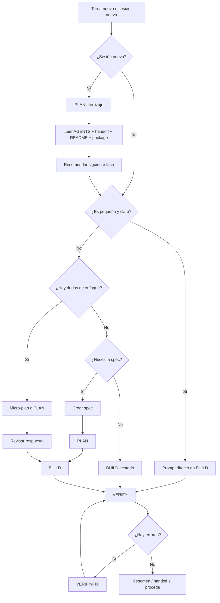

# GUIA_TRABAJO_OPENCODE.md

# Guía de trabajo con OpenCode

Esta guía define una forma práctica de trabajar con **OpenCode** en proyectos de desarrollo.

La idea principal es trabajar de forma controlada, por fases y con tareas pequeñas, evitando pedirle al agente cambios demasiado amplios o poco definidos.

El objetivo no es usar siempre el mismo flujo para todo, sino elegir la forma de trabajo adecuada según el tipo de tarea.

---

## 1. Principio general

La forma de trabajo base es:

```txt
EXPLORE → PLAN → BUILD → VERIFY
```

Pero no todas las tareas necesitan pasar por todas las fases.

La regla principal es:

```txt
No todo necesita spec.
No todo necesita plan.
Pero todo necesita alcance claro.
```

OpenCode debe usarse como un agente de trabajo por fases:

```txt
Entender
  ↓
Planificar si hace falta
  ↓
Ejecutar con alcance claro
  ↓
Verificar
  ↓
Documentar si procede
```

---

## 2. Fases de trabajo

## EXPLORE

Se usa para entender el proyecto o una parte concreta **sin modificar archivos**.

Usar cuando:

```txt
- Empiezas en un proyecto nuevo.
- Hay que entender una arquitectura existente.
- No sabes qué archivos están implicados.
- Hay un bug y primero quieres diagnóstico.
- Hay riesgo de tocar más de la cuenta.
```

Ejemplo:

```txt
Explora el proyecto sin modificar archivos.

Objetivo:
Entender cómo está organizada la home y qué archivos habría que tocar para añadir una nueva sección.

No hagas cambios todavía.

Devuélveme:
- Archivos relevantes.
- Cómo está estructurada la sección actual.
- Riesgos detectados.
- Propuesta breve de ejecución.
```

---

## PLAN

Se usa para pedir un plan, aterrizar contexto o decidir el siguiente paso **antes de ejecutar cambios**.

Usar cuando:

```txt
- Estás empezando una sesión nueva.
- Quieres aterrizar el estado actual del proyecto.
- La tarea tiene varias partes.
- Puede afectar a varios archivos.
- Hay decisiones técnicas.
- Hay dudas sobre el enfoque.
- Quieres validar antes de que toque código.
```

Ejemplo:

```txt
Crea un plan para implementar esta feature.

No modifiques archivos todavía.

Objetivo:
Crear una página de detalle para proyectos.

El plan debe incluir:
- Archivos que tocarías.
- Orden de ejecución.
- Riesgos.
- Verificaciones.
- Qué no debe hacerse todavía.
```

---

## BUILD

Se usa para ejecutar cambios.

Usar cuando:

```txt
- El alcance ya está claro.
- La tarea está definida.
- Hay una spec aprobada.
- Hay un plan aprobado.
- Es un cambio pequeño y no hace falta plan.
```

Ejemplo:

```txt
Ejecuta únicamente esta tarea.

No avances otras tareas.
No cambies arquitectura.
No añadas dependencias salvo que sea imprescindible.

Al terminar, muestra:
- Archivos modificados.
- Cambios realizados.
- Comandos ejecutados.
- Resultado de build/check si procede.
```

---

## VERIFY

Se usa para revisar, validar o corregir.

Usar cuando:

```txt
- Hay un bug.
- Hay error de consola.
- Hay error de build.
- Algo no funciona tras una tarea.
- Quieres revisar sin avanzar.
- Quieres comprobar SEO, accesibilidad o rendimiento.
```

Ejemplo:

```txt
Revisa y corrige únicamente esta incidencia:

[PEGAR ERROR]

No avances ninguna feature nueva.
No hagas refactors fuera de alcance.

Objetivo:
Diagnosticar y corregir el error con el mínimo cambio necesario.

Al terminar, muestra:
- Causa probable.
- Archivos modificados.
- Comandos ejecutados.
- Resultado de verificaciones.
- Confirmación de si el error desapareció.
```

---

## 3. Diferencia entre AGENTS, SKILLS y SPECS

Es importante distinguir estos conceptos.

```txt
AGENTS
├── Reglas generales de comportamiento
├── Indican cómo debe trabajar OpenCode
└── Aplican durante todo el proyecto

SKILLS
├── Capacidades especializadas
├── Aportan criterio técnico
└── Se aplican cuando la tarea lo necesita

SPECS
├── Tareas concretas
├── Definen qué hay que hacer ahora
└── Se ejecutan una a una
```

Resumen rápido:

```txt
AGENTS = cómo debe trabajar el agente.
SKILLS = qué criterio especializado debe aplicar.
SPECS = qué tarea concreta debe ejecutar.
```

Ejemplo:

```txt
AGENTS:
- No avanzar a la siguiente tarea sin permiso.
- No añadir dependencias innecesarias.
- Actualizar handoff si procede.

SKILLS:
- Accesibilidad.
- SEO.
- Performance.
- Astro.
- WordPress.
- Tailwind.

SPECS:
- Crear Hero.
- Crear página de proyectos.
- Añadir página /repos/.
- Corregir bug de rutas.
```

---

## 4. Uso de `AGENTS.md` en OpenCode

`AGENTS.md` funciona como la regla base del proyecto para el agente.

Se puede entender así:

```txt
README.md  → sirve para entender el proyecto
AGENTS.md  → sirve para saber cómo debe trabajar el agente dentro del proyecto
```

Por tanto, `AGENTS.md` no es una spec ni una tarea concreta. Es el archivo que define el comportamiento general que OpenCode debe respetar mientras trabaja en ese repositorio.

---

### Cuándo leer `AGENTS.md`

#### 1. Al abrir una sesión nueva de OpenCode

Siempre conviene leerlo al empezar una sesión nueva.

Ejemplo:

```txt
Lee AGENTS.md, docs/handoff.md y la spec actual antes de tocar nada.
```

Esto ayuda a que el agente entienda las reglas generales antes de modificar código.

---

#### 2. Cuando cambias de modelo

También conviene releerlo si cambias de modelo durante el trabajo.

Por ejemplo:

```txt
DeepSeek V4 Pro → GLM-5.1
GPT-5.5 → Qwen
```

El nuevo modelo no tiene por qué arrastrar correctamente todas las reglas de trabajo anteriores, así que es mejor reforzar el contexto.

---

#### 3. Antes de ejecutar una spec

Si la spec implica cambios reales en código, conviene que OpenCode tenga presentes las reglas de `AGENTS.md`.

Orden recomendado:

```txt
AGENTS.md
docs/handoff.md
specs/xxx.md
```

Si el proyecto tiene más documentación relevante, también puede añadirse:

```txt
AGENTS.md
docs/project-context.md
docs/handoff.md
specs/xxx.md
```

---

#### 4. Después de una pausa larga

Si vuelves al proyecto después de varios días, aunque estés en la misma rama, es recomendable releer `AGENTS.md`.

Esto evita que el agente trabaje con contexto incompleto o desactualizado.

---

#### 5. Antes de cambios delicados

Conviene releer `AGENTS.md` antes de tocar partes sensibles del proyecto.

Ejemplos:

```txt
- Cambiar arquitectura.
- Añadir dependencias.
- Tocar astro.config.mjs.
- Cambiar sistema de content collections.
- Cambiar build o deploy.
- Tocar SEO global.
- Tocar accesibilidad global.
- Modificar estructura de rutas.
```

---

### Cuándo no hace falta repetirlo tanto

Si estás en la misma sesión, con el mismo modelo, y encadenando tareas pequeñas, no hace falta pedirle que lea `AGENTS.md` completo cada vez.

En ese caso basta con decir:

```txt
Sigue las reglas de AGENTS.md y ejecuta únicamente esta tarea.
```

O, si estás ejecutando una spec:

```txt
Sigue AGENTS.md y ejecuta únicamente esta spec.
```

---

### Regla práctica

```txt
Sesión nueva → leer AGENTS.md completo.
Spec nueva en la misma sesión → seguir AGENTS.md + leer spec actual.
Bug delicado → releer AGENTS.md + handoff + archivos afectados.
Cambio de modelo → releer AGENTS.md.
Cambio pequeño en la misma sesión → basta con “sigue AGENTS.md”.
```

---

### Idea clave

`AGENTS.md` debe funcionar como una regla base persistente del repositorio.

No hace falta copiar sus reglas completas en cada prompt, pero sí conviene pedir a OpenCode que las tenga presentes cuando empieza una sesión, cambia de modelo, ejecuta una spec o toca zonas delicadas.

---

## 5. Cuándo usar spec

No hay que crear una spec para todo.

Una spec tiene sentido cuando necesitas control, continuidad o trazabilidad.

---

### No hace falta spec si...

```txt
- Es un cambio pequeño.
- Afecta a pocos archivos.
- No cambia arquitectura.
- No añade dependencias.
- No crea rutas nuevas.
- No toca datos complejos.
- Se puede verificar rápido.
```

Ejemplos:

```txt
- Cambiar un texto.
- Añadir una imagen.
- Añadir una sección simple.
- Ajustar un estilo.
- Corregir un alt.
- Cambiar un enlace.
- Añadir un botón.
```

---

### Sí conviene spec si...

```txt
- La tarea afecta a varios archivos.
- Crea componentes reutilizables.
- Crea páginas nuevas.
- Crea rutas.
- Usa datos dinámicos.
- Afecta a SEO de forma importante.
- Puede cambiar arquitectura.
- Forma parte de una migración.
- Necesitas continuar en otra sesión.
```

Ejemplos:

```txt
- Crear sistema de proyectos.
- Crear página de detalle.
- Crear sección reutilizable compleja.
- Crear navegación nueva.
- Migrar una home completa.
- Hacer un refactor.
- Integrar datos desde CMS, JSON, Markdown o API.
```

---

## 6. Cuándo pedir PLAN

No siempre hace falta pedir PLAN.

---

### No hace falta PLAN si...

```txt
- La tarea es pequeña.
- El objetivo está claro.
- El alcance está cerrado.
- No hay decisiones técnicas relevantes.
```

Ejemplo:

```txt
Añade una sección simple con título e imagen en la home.
```

Flujo recomendado:

```txt
Prompt directo → BUILD → Verificación rápida
```

---

### Sí conviene PLAN si...

```txt
- Estás aterrizando en una sesión nueva.
- Hay varias formas de hacerlo.
- No sabes qué archivos tocar.
- Puede afectar a arquitectura.
- Puede afectar a varias páginas.
- Hay riesgo de que el agente se adelante.
- Quieres revisar antes de ejecutar.
```

Flujo recomendado:

```txt
PLAN → revisar → BUILD
```

---

## 7. Niveles de tarea

### Nivel 0 — Aterrizaje de sesión

Sirve para empezar una sesión nueva de OpenCode sin tocar código.

No ejecuta specs.

No modifica archivos.

No lee todas las specs.

Objetivo:

```txt
Aterrizar en el estado actual del proyecto antes de decidir el siguiente paso.
```

Flujo:

```txt
PLAN aterrizaje
  ↓
Leer contexto mínimo
  ↓
Detectar estado actual
  ↓
Recomendar siguiente fase
```

Usar cuando:

```txt
- Empiezas una sesión nueva.
- Vuelves al proyecto tras una pausa.
- Cambias de modelo.
- No sabes exactamente en qué punto quedó el proyecto.
- Quieres evitar que el agente lea todo o avance specs.
```

---

### Nivel 1 — Cambio pequeño

No necesita spec ni plan.

```txt
Prompt directo
  ↓
BUILD
  ↓
Resumen final
```

Ejemplos:

```txt
- Cambiar texto.
- Añadir botón.
- Añadir imagen.
- Ajustar clase CSS.
- Añadir sección simple.
```

---

### Nivel 2 — Cambio pequeño con dudas

No necesita spec, pero puede usar micro-plan.

```txt
Micro-plan
  ↓
BUILD
  ↓
Verificación
```

Ejemplos:

```txt
- Añadir una sección pero no sabes si crear componente.
- Modificar una parte visual con varios archivos posibles.
- Ajustar responsive de un bloque existente.
```

---

### Nivel 3 — Feature importante

Conviene usar spec y plan.

```txt
SPEC
  ↓
PLAN
  ↓
BUILD
  ↓
VERIFY
```

Ejemplos:

```txt
- Nueva página.
- Nuevo sistema de datos.
- Nueva ruta.
- Componente reutilizable importante.
- Integración con contenido dinámico.
```

---

### Nivel 4 — Bug delicado, arquitectura o migración

Usar fases completas.

```txt
EXPLORE
  ↓
PLAN
  ↓
BUILD/FIX
  ↓
VERIFY
```

Ejemplos:

```txt
- Error de build.
- Error de consola persistente.
- Migración.
- Refactor grande.
- Problema de rutas.
- Problema con dependencias.
```

---

## 8. Modelos recomendados según tipo de trabajo

Esta tabla sirve como orientación práctica para elegir modelo según la fase de trabajo en OpenCode.

No es una regla rígida. La elección puede cambiar según el tamaño de la tarea, el riesgo, el coste en tokens y el nivel de revisión que necesite.

| Caso                              | PLAN                              | BUILD                     | REVIEW                |
| --------------------------------- | --------------------------------- | ------------------------- | --------------------- |
| Aterrizaje de sesión              | DeepSeek V4 Pro / GPT-5.5         | —                         | —                     |
| Documentación                     | DeepSeek V4 Pro                   | DeepSeek V4 Pro           | DeepSeek V4 Pro       |
| Workflow / agentes / guía interna | DeepSeek V4 Pro                   | DeepSeek V4 Pro           | DeepSeek V4 Pro       |
| Código normal                     | GPT-5.5 o DeepSeek V4 Pro         | GLM-5.1                   | DeepSeek V4 Pro       |
| Código delicado                   | GPT-5.5                           | GPT-5.5 o GLM-5.1         | GPT-5.5               |
| Accesibilidad                     | GPT-5.5 si afecta a varias partes | GLM-5.1                   | GPT-5.5 si es crítico |
| SEO técnico                       | GPT-5.5 si es técnico             | GLM-5.1                   | GPT-5.5               |
| CSS / SCSS simple                 | DeepSeek V4 Pro                   | GLM-5.1                   | DeepSeek V4 Pro       |
| Cambio mínimo                     | —                                 | GLM-5.1 / DeepSeek V4 Pro | Opcional              |

Regla práctica:

```txt
Documentación / guías / specs / AGENTS → DeepSeek V4 Pro suele ser suficiente.
Aterrizaje de sesión → DeepSeek V4 Pro o GPT-5.5.
Código normal → PLAN con GPT-5.5 o DeepSeek V4 Pro, BUILD con GLM-5.1.
Código delicado → GPT-5.5 en PLAN y REVIEW.
Cambios mínimos → BUILD directo con GLM-5.1 o DeepSeek V4 Pro.
```

La idea no es usar siempre el modelo más potente, sino reservarlo para las fases donde aporta más valor:

```txt
- PLAN complejo.
- REVIEW crítico.
- Arquitectura.
- Accesibilidad importante.
- SEO técnico.
- Bugs delicados.
```

---

# 9. Plantillas de prompts

---

## 9.1. Plantilla de aterrizaje de sesión nueva

Usar al abrir una sesión nueva de OpenCode y querer entender el estado actual antes de ejecutar cambios.

No debe modificar archivos.

No debe ejecutar specs.

No debe leer todas las specs.

Información para elegir fase/modelo:

```txt
Fase: PLAN aterrizaje
PLAN
Modelo: DeepSeek V4 Pro / GPT-5.5
```

Prompt para copiar y pegar:

```txt
Estoy empezando una sesión nueva del proyecto [NOMBRE_PROYECTO].

Objetivo:
Aterrizar en el estado actual del proyecto antes de ejecutar cambios.

Lee solo:

- AGENTS.md
- docs/handoff.md
- README.md
- package.json

No modifiques archivos.
No ejecutes ninguna spec.
No avances tareas.
No leas todas las specs.

Devuélveme:

1. Estado actual del proyecto.
2. Stack detectado.
3. Última situación registrada en docs/handoff.md.
4. Incidencias pendientes, si las hay.
5. Próximo paso recomendado.
6. Fase recomendada para ese siguiente paso: EXPLORE, PLAN, BUILD o VERIFY.
7. Comandos mínimos que convendría ejecutar antes de tocar código.
```

Ejemplo aplicado:

```txt
Estoy empezando una sesión nueva del proyecto Portfolio 3.0 — Spanioulis.

Objetivo:
Aterrizar en el estado actual del proyecto antes de ejecutar cambios.

Lee solo:

- AGENTS.md
- docs/handoff.md
- README.md
- package.json

No modifiques archivos.
No ejecutes ninguna spec.
No avances tareas.
No leas todas las specs.

Devuélveme:

1. Estado actual del proyecto.
2. Stack detectado.
3. Última situación registrada en docs/handoff.md.
4. Incidencias pendientes, si las hay.
5. Próximo paso recomendado.
6. Fase recomendada para ese siguiente paso: EXPLORE, PLAN, BUILD o VERIFY.
7. Comandos mínimos que convendría ejecutar antes de tocar código.
```

---

## 9.2. Plantilla fija para cambio pequeño sin spec

Usar cuando la tarea sea pequeña, localizada y no requiera una spec formal.

Está pensada para pegarse directamente en una sesión `BUILD`.

La parte fija va primero.

La parte variable va al final, para no tener que editar líneas ya pegadas.

Información para elegir fase/modelo:

```txt
Fase: BUILD cambio pequeño
BUILD
Modelo: GLM-5.1 / DeepSeek V4 Pro
```

Prompt para copiar y pegar:

```txt
Añade una mejora pequeña y localizada siguiendo estas reglas.

Alcance:
- Modifica solo los archivos necesarios.
- Reutiliza la estructura y estilos existentes.
- No añadas dependencias.
- No cambies arquitectura.
- No avances otras tareas.
- Mantén HTML semántico y responsive.
- Revisa accesibilidad básica: alt correcto, heading coherente y foco si aplica.

Al terminar, muestra:
- Archivos modificados.
- Cambios realizados.
- Comandos ejecutados.
- Resultado de build/check si procede.

Objetivo concreto:
[AQUÍ IRA EL OBJETIVO DEL PROMPT, LA FEATURE O EL CAMBIO QUE QUEREMOS CONSEGUIR]
```

Ejemplo aplicado:

```txt
Añade una mejora pequeña y localizada siguiendo estas reglas.

Alcance:
- Modifica solo los archivos necesarios.
- Reutiliza la estructura y estilos existentes.
- No añadas dependencias.
- No cambies arquitectura.
- No avances otras tareas.
- Mantén HTML semántico y responsive.
- Revisa accesibilidad básica: alt correcto, heading coherente y foco si aplica.

Al terminar, muestra:
- Archivos modificados.
- Cambios realizados.
- Comandos ejecutados.
- Resultado de build/check si procede.

Objetivo concreto:
Añade una sección simple con título e imagen en la home.
```

---

## 9.3. Plantilla para cambio pequeño con micro-plan

Usar cuando el cambio parece pequeño, pero quieres que OpenCode piense antes de tocar archivos.

Información para elegir fase/modelo:

```txt
Fase: PLAN micro-cambio
PLAN
Modelo: DeepSeek V4 Pro / GPT-5.5
```

Prompt para copiar y pegar:

```txt
Quiero hacer una mejora pequeña y localizada.

Antes de modificar archivos, dime brevemente:

- Qué archivos tocarías.
- Si crearías componente nuevo o reutilizarías uno existente.
- Riesgos mínimos.
- Si ves necesario crear una spec formal o no.

Después, si confirmas que el alcance es simple, ejecuta el cambio sin crear una spec formal.

Reglas:
- Modifica solo los archivos necesarios.
- Reutiliza la estructura y estilos existentes.
- No añadas dependencias.
- No cambies arquitectura.
- No avances otras tareas.
- Mantén HTML semántico y responsive.
- Revisa accesibilidad básica.

Objetivo concreto:
[AQUÍ IRA EL OBJETIVO DEL PROMPT]
```

Ejemplo aplicado:

```txt
Quiero hacer una mejora pequeña y localizada.

Antes de modificar archivos, dime brevemente:

- Qué archivos tocarías.
- Si crearías componente nuevo o reutilizarías uno existente.
- Riesgos mínimos.
- Si ves necesario crear una spec formal o no.

Después, si confirmas que el alcance es simple, ejecuta el cambio sin crear una spec formal.

Reglas:
- Modifica solo los archivos necesarios.
- Reutiliza la estructura y estilos existentes.
- No añadas dependencias.
- No cambies arquitectura.
- No avances otras tareas.
- Mantén HTML semántico y responsive.
- Revisa accesibilidad básica.

Objetivo concreto:
Añade una sección simple con título e imagen en la home.
```

---

## 9.4. Plantilla para pedir PLAN

Usar cuando quieres revisar el enfoque antes de ejecutar.

Información para elegir fase/modelo:

```txt
Fase: PLAN feature
PLAN
Modelo: DeepSeek V4 Pro / GPT-5.5
```

Prompt para copiar y pegar:

```txt
Crea un plan para esta tarea.

No modifiques archivos todavía.

Objetivo:
[AQUÍ IRA EL OBJETIVO]

El plan debe incluir:
- Archivos que tocarías.
- Orden de ejecución.
- Riesgos.
- Verificaciones necesarias.
- Qué no debe hacerse todavía.
- Si ves necesario crear una spec formal.

No ejecutes cambios.
```

---

## 9.5. Plantilla para ejecutar un PLAN aprobado

Usar cuando OpenCode ya ha creado un plan y tú lo has revisado.

Información para elegir fase/modelo:

```txt
Fase: BUILD plan aprobado
BUILD
Modelo: GLM-5.1 / GPT-5.5
```

Prompt para copiar y pegar:

```txt
Sí, apruebo el plan.

Ejecuta los cambios siguiendo exactamente este alcance:

[PEGAR AQUÍ EL PLAN APROBADO O SUS TAREAS]

Reglas:
- No amplíes el alcance.
- No añadas features nuevas.
- No cambies arquitectura salvo que el plan lo indique.
- No añadas dependencias salvo que el plan lo justifique.
- No avances a otra tarea.
- Si aparece un problema que obliga a cambiar el plan, para y explica la situación antes de seguir.

Al terminar, muestra:
- Archivos modificados.
- Cambios realizados.
- Comandos ejecutados.
- Resultado de check/build/dev si procede.
- Problemas encontrados.
- Estado final.
- Próximo paso recomendado.
```

---

## 9.6. Plantilla para ejecutar una spec

Usar cuando la tarea ya está definida en una spec.

Información para elegir fase/modelo:

```txt
Fase: BUILD spec
BUILD
Modelo: GLM-5.1 / GPT-5.5
```

Prompt para copiar y pegar:

```txt
Ejecuta únicamente la spec:

specs/XXX-nombre.md

Antes de tocar nada, lee:

- AGENTS.md
- docs/handoff.md
- la spec indicada

No avances a la siguiente spec.
No amplíes el alcance.

Al terminar, actualiza la spec si procede y muestra:

- Archivos modificados.
- Cambios realizados.
- Comandos ejecutados.
- Resultado de check/build/dev.
- Problemas encontrados.
- Estado final de la spec.
- Próxima spec recomendada.
```

Versión con más contexto, para proyectos con documentación adicional:

```txt
Ejecuta únicamente la spec:

specs/XXX-nombre.md

Antes de tocar nada, lee:

- AGENTS.md
- docs/project-context.md
- docs/handoff.md
- specs/XXX-nombre.md

No avances a la siguiente spec.
No amplíes el alcance.

Al terminar, actualiza:

- docs/handoff.md
- specs/XXX-nombre.md

Y muestra:

- Archivos modificados.
- Cambios realizados.
- Comandos ejecutados.
- Resultado de check/build/dev.
- Problemas encontrados.
- Estado final de la spec.
- Próxima spec recomendada.
```

---

## 9.7. Plantilla para bug o incidencia

Usar cuando algo falla y no quieres avanzar features.

Información para elegir fase/modelo:

```txt
Fase: VERIFY/FIX
VERIFY
Modelo: GPT-5.5 / DeepSeek V4 Pro
```

Prompt para copiar y pegar:

```txt
Revisa y corrige únicamente esta incidencia:

[PEGAR ERROR O DESCRIPCIÓN DEL BUG]

No avances ninguna feature nueva.
No hagas refactors fuera de alcance.
No cambies arquitectura salvo que sea imprescindible y lo justifiques.

Objetivo:
Diagnosticar y corregir el error con el mínimo cambio necesario.

Comprobaciones mínimas:
- Ejecutar los comandos necesarios de diagnóstico.
- Corregir solo lo necesario.
- Ejecutar check/build/dev si procede.
- Verificar la ruta o funcionalidad afectada.

Al terminar, muestra:
- Causa probable.
- Archivos modificados.
- Comandos ejecutados.
- Resultado de verificaciones.
- Confirmación de si el error desapareció.
- Estado final.
```

---

## 9.8. Plantilla para VERIFY sin modificar archivos

Usar cuando solo quieres revisar el estado.

Información para elegir fase/modelo:

```txt
Fase: VERIFY lectura
VERIFY
Modelo: DeepSeek V4 Pro / GPT-5.5
```

Prompt para copiar y pegar:

```txt
Verifica el estado actual sin modificar archivos.

Objetivo:
[AQUÍ IRA LO QUE QUIERES COMPROBAR]

No hagas cambios.

Devuélveme:
- Estado actual.
- Archivos relevantes.
- Posibles problemas.
- Verificaciones pendientes.
- Recomendación de siguiente paso.
```

---

## 10. Reglas de control de alcance

Frases útiles para añadir a cualquier prompt:

```txt
No avances a otra tarea.
```

```txt
No hagas cambios fuera de alcance.
```

```txt
No añadas dependencias salvo que sea imprescindible y lo justifiques.
```

```txt
No cambies arquitectura salvo que sea necesario y lo expliques antes.
```

```txt
Si detectas que este cambio no es pequeño, para y propón crear una spec o un plan.
```

```txt
Antes de modificar archivos, dime qué archivos tocarías.
```

```txt
Ejecuta exactamente el plan aprobado.
```

```txt
No marques la tarea como completada si no pasan las verificaciones.
```

```txt
No leas todas las specs.
```

```txt
No ejecutes ninguna spec.
```

---

## 11. Verificaciones

Las verificaciones dependen del proyecto.

Ejemplos habituales:

```bash
pnpm check
pnpm build
pnpm dev
```

En Astro puede ser:

```bash
pnpm astro check
pnpm build
pnpm dev
```

En algunos casos:

```bash
pnpm astro sync
pnpm preview
```

También puede ser necesario revisar:

```txt
- Consola del navegador.
- Responsive.
- SEO básico.
- Accesibilidad básica.
- Rutas afectadas.
- Formularios.
- Imágenes.
```

Regla:

```txt
Una tarea solo se considera cerrada si pasa las verificaciones necesarias.
```

Si no pasan, el estado debe quedar claro:

```txt
- Completada.
- Completada parcialmente.
- Pendiente de fix.
- Bloqueada.
- En revisión.
```

---

## 12. Tabla rápida de decisión

```txt
¿Estoy empezando una sesión nueva?
├── Sí → PLAN aterrizaje.
└── No → Siguiente pregunta.

¿Es un cambio pequeño y claro?
├── Sí → Prompt directo sin spec.
└── No → Siguiente pregunta.

¿Hay alguna duda sobre archivos o enfoque?
├── Sí → Micro-plan.
└── No → BUILD directo.

¿Toca varios archivos, rutas, datos o arquitectura?
├── Sí → Crear spec.
└── No → Prompt acotado.

¿Hay riesgo de romper algo importante?
├── Sí → PLAN antes de BUILD.
└── No → BUILD.

¿Es un bug?
├── Sí → VERIFY/FIX, no avanzar features.
└── No → Flujo normal.

¿Es migración o refactor grande?
├── Sí → EXPLORE → PLAN → BUILD → VERIFY.
└── No → Elegir nivel según alcance.
```

---

## 13. Tabla de casos

| Caso                   |     Spec |            Plan | Flujo                           |
| ---------------------- | -------: | --------------: | ------------------------------- |
| Aterrizar sesión nueva |       No |              Sí | PLAN aterrizaje                 |
| Cambiar texto          |       No |              No | Prompt directo                  |
| Añadir imagen          |       No |              No | Prompt directo                  |
| Añadir sección simple  |       No | No / micro-plan | Prompt directo                  |
| Ajuste CSS pequeño     |       No |              No | Prompt directo                  |
| Componente pequeño     | Opcional |      Micro-plan | Prompt acotado                  |
| Nueva página           |       Sí |              Sí | Spec → Plan → Build             |
| Nueva ruta             |       Sí |              Sí | Spec → Plan → Build             |
| Sistema de datos       |       Sí |              Sí | Explore → Plan → Build          |
| Migración              |       Sí |              Sí | Explore → Plan → Build → Verify |
| Bug simple             |       No |              No | Verify/Fix                      |
| Bug delicado           | Opcional |              Sí | Explore → Plan → Fix            |
| Refactor grande        |       Sí |              Sí | Spec → Plan → Build             |

---

## 14. Diagrama general



---

## 15. Resumen final

```txt
Sesión nueva → PLAN aterrizaje.
Cambio pequeño → prompt directo.
Cambio pequeño con dudas → micro-plan.
Feature importante → spec + plan.
Bug → VERIFY/FIX.
Migración o arquitectura → EXPLORE + PLAN + BUILD + VERIFY.
```

```txt
AGENTS marcan cómo trabajar.
SKILLS aportan criterio especializado.
SPECS definen qué se hace ahora.
```

```txt
No todo necesita spec.
No todo necesita plan.
Pero todo necesita alcance claro.
```

```txt
No leas todo por defecto.
Lee solo lo necesario para la fase actual.
```
