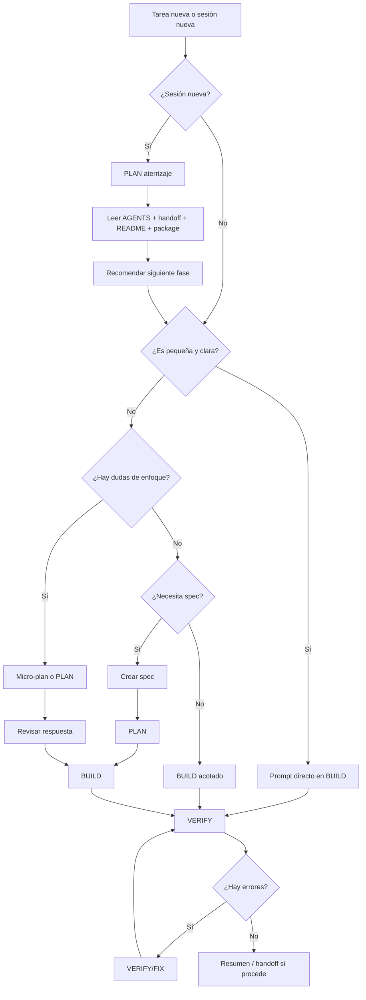

# Referencia de trabajo con OpenCode

> **Uso:** al iniciar un proyecto nuevo o cambiar de contexto.  
> **Para los prompts copiables de uso diario:** consulta [`GUIA_TRABAJO_OPENCODE.md`](./GUIA_TRABAJO_OPENCODE.md).

---

## 1. Principio general

La forma de trabajo base es:

```txt
EXPLORE → PLAN → BUILD → VERIFY
```

Pero no todas las tareas necesitan pasar por todas las fases.

La regla principal es:

```txt
No todo necesita spec.
No todo necesita plan.
Pero todo necesita alcance claro.
```

OpenCode debe usarse como un agente de trabajo por fases:

```txt
Entender
  ↓
Planificar si hace falta
  ↓
Ejecutar con alcance claro
  ↓
Verificar
  ↓
Documentar si procede
```

---

## 2. Fases de trabajo

## <font color="#F97316">🔍 EXPLORE</font>

Se usa para entender el proyecto o una parte concreta **sin modificar archivos**.

Usar cuando:

```txt
- Empiezas en un proyecto nuevo.
- Hay que entender una arquitectura existente.
- No sabes qué archivos están implicados.
- Hay un bug y primero quieres diagnóstico.
- Hay riesgo de tocar más de la cuenta.
```

**Modelo recomendado:** DeepSeek V4 Pro o GPT-5.5. Reserva GPT-5.5 para bugs delicados o arquitectura compleja.

Ejemplo:

```txt
Explora el proyecto sin modificar archivos.

Objetivo:
Entender cómo está organizada la home y qué archivos habría que tocar para añadir una nueva sección.

No hagas cambios todavía.

Devuélveme:
- Archivos relevantes.
- Cómo está estructurada la sección actual.
- Riesgos detectados.
- Propuesta breve de ejecución.
```

---

## <font color="#3B82F6">📋 PLAN</font>

Se usa para pedir un plan, aterrizar contexto o decidir el siguiente paso **antes de ejecutar cambios**.

Usar cuando:

```txt
- Estás empezando una sesión nueva.
- Quieres aterrizar el estado actual del proyecto.
- La tarea tiene varias partes.
- Puede afectar a varios archivos.
- Hay decisiones técnicas.
- Hay dudas sobre el enfoque.
- Quieres validar antes de que toque código.
```

**Modelo recomendado:** DeepSeek V4 Pro o GPT-5.5. Usa GPT-5.5 si el plan implica decisiones arquitectónicas, accesibilidad importante, SEO técnico o bugs delicados.

Ejemplo:

```txt
Crea un plan para implementar esta feature.

No modifiques archivos todavía.

Objetivo:
Crear una página de detalle para proyectos.

El plan debe incluir:
- Archivos que tocarías.
- Orden de ejecución.
- Riesgos.
- Verificaciones.
- Qué no debe hacerse todavía.
```

---

## <font color="#2563EB">🔨 BUILD</font>

Se usa para ejecutar cambios.

Usar cuando:

```txt
- El alcance ya está claro.
- La tarea está definida.
- Hay una spec aprobada.
- Hay un plan aprobado.
- Es un cambio pequeño y no hace falta plan.
```

**Modelo recomendado:** GLM-5.1 para código normal. GPT-5.5 para código delicado. DeepSeek V4 Pro para documentación, guías o cambios mínimos.

Ejemplo:

```txt
Ejecuta únicamente esta tarea.

No avances otras tareas.
No cambies arquitectura.
No añadas dependencias salvo que sea imprescindible.

Al terminar, muestra:
- Archivos modificados.
- Cambios realizados.
- Comandos ejecutados.
- Resultado de build/check si procede.
```

---

## <font color="#10B981">✅ VERIFY</font>

Se usa para revisar, validar o corregir.

Usar cuando:

```txt
- Hay un bug.
- Hay error de consola.
- Hay error de build.
- Algo no funciona tras una tarea.
- Quieres revisar sin avanzar.
- Quieres comprobar SEO, accesibilidad o rendimiento.
```

**Modelo recomendado:** DeepSeek V4 Pro o GPT-5.5. Usa GPT-5.5 para REVIEW crítico, accesibilidad, SEO técnico o bugs delicados.

Ejemplo:

```txt
Revisa y corrige únicamente esta incidencia:

[PEGAR ERROR]

No avances ninguna feature nueva.
No hagas refactors fuera de alcance.

Objetivo:
Diagnosticar y corregir el error con el mínimo cambio necesario.

Al terminar, muestra:
- Causa probable.
- Archivos modificados.
- Comandos ejecutados.
- Resultado de verificaciones.
- Confirmación de si el error desapareció.
```

---

### Regla práctica de modelos

La idea no es usar siempre el modelo más potente, sino reservarlo para las fases donde aporta más valor:

```txt
Documentación / guías / specs / AGENTS → DeepSeek V4 Pro suele ser suficiente.
Aterrizaje de sesión → DeepSeek V4 Pro o GPT-5.5.
Código normal → PLAN con GPT-5.5 o DeepSeek V4 Pro, BUILD con GLM-5.1.
Código delicado → GPT-5.5 en PLAN y REVIEW.
Cambios mínimos → BUILD directo con GLM-5.1 o DeepSeek V4 Pro.
```

---

## 3. Diferencia entre AGENTS, SKILLS y SPECS

Es importante distinguir estos conceptos.

```txt
AGENTS
├── Reglas generales de comportamiento
├── Indican cómo debe trabajar OpenCode
└── Aplican durante todo el proyecto

SKILLS
├── Capacidades especializadas
├── Aportan criterio técnico
└── Se aplican cuando la tarea lo necesita

SPECS
├── Tareas concretas
├── Definen qué hay que hacer ahora
└── Se ejecutan una a una
```

Resumen rápido:

```txt
AGENTS = cómo debe trabajar el agente.
SKILLS = qué criterio especializado debe aplicar.
SPECS = qué tarea concreta debe ejecutar.
```

Ejemplo:

```txt
AGENTS:
- No avanzar a la siguiente tarea sin permiso.
- No añadir dependencias innecesarias.
- Actualizar handoff si procede.

SKILLS:
- Accesibilidad.
- SEO.
- Performance.
- Astro.
- WordPress.
- Tailwind.

SPECS:
- Crear Hero.
- Crear página de proyectos.
- Añadir página /repos/.
- Corregir bug de rutas.
```

---

## 4. Uso de `AGENTS.md` en OpenCode

`AGENTS.md` es la regla base del proyecto para el agente. No es una spec ni una tarea: define cómo debe comportarse OpenCode en ese repositorio.

```txt
README.md  → para entender el proyecto.
AGENTS.md  → para saber cómo debe trabajar el agente.
```

### Cuándo leerlo completo

| Situación | Acción |
|---|---|
| Sesión nueva | Leer AGENTS.md + handoff + spec actual |
| Cambio de modelo | Releer AGENTS.md |
| Vuelta tras pausa larga | Releer AGENTS.md |
| Cambios delicados (arquitectura, dependencias, rutas, SEO global, build/deploy) | Releer AGENTS.md + handoff + archivos afectados |

### Cuándo basta con "sigue AGENTS.md"

En la misma sesión, mismo modelo, tareas pequeñas encadenadas:

```txt
Sigue las reglas de AGENTS.md y ejecuta únicamente esta tarea.
```

### Orden de lectura recomendado

```txt
AGENTS.md → docs/handoff.md → spec actual
```

Con más documentación:

```txt
AGENTS.md → docs/handoff.md → docs/project-context.md → spec actual
```

---

## 5. Cuándo usar spec y cuándo pedir <font color="#3B82F6">📋 PLAN</font>

No todo necesita spec. No todo necesita plan. Pero todo necesita alcance claro.

| Situación | ¿Spec? | ¿<font color="#3B82F6">📋 PLAN</font>? | Flujo |
|---|---|---|---|
| Cambio pequeño y claro (texto, imagen, estilo, botón) | No | No | Prompt directo |
| Cambio pequeño con dudas de enfoque | No | Micro-plan | Micro-plan → <font color="#2563EB">🔨 BUILD</font> |
| Varios archivos, rutas, datos o arquitectura | Sí | Sí | Spec → <font color="#3B82F6">📋 Plan</font> → <font color="#2563EB">🔨 Build</font> |
| Bug simple | No | No | <font color="#10B981">✅ VERIFY/FIX</font> |
| Bug delicado | Opcional | Sí | <font color="#F97316">🔍 EXPLORE</font> → <font color="#3B82F6">📋 Plan</font> → <font color="#10B981">✅ Fix</font> |
| Migración o refactor grande | Sí | Sí | <font color="#F97316">🔍 EXPLORE</font> → <font color="#3B82F6">📋 Plan</font> → <font color="#2563EB">🔨 Build</font> → <font color="#10B981">✅ VERIFY</font> |

**No hace falta spec** si el cambio es pequeño, afecta a pocos archivos, no cambia arquitectura, no añade dependencias, no crea rutas y se puede verificar rápido. Ejemplos: cambiar un texto, añadir una imagen, ajustar un estilo, corregir un alt, cambiar un enlace, añadir un botón.

**Sí conviene spec** si la tarea afecta a varios archivos, crea componentes reutilizables, páginas o rutas nuevas, usa datos dinámicos, afecta a SEO de forma importante, o necesitas continuar en otra sesión. Ejemplos: crear sistema de proyectos, página de detalle, sección reutilizable compleja, integración con CMS/API.

**No hace falta <font color="#3B82F6">📋 PLAN</font>** si la tarea es pequeña, el objetivo está claro, el alcance está cerrado y no hay decisiones técnicas relevantes.

**Sí conviene <font color="#3B82F6">📋 PLAN</font>** si estás aterrizando en una sesión nueva, hay varias formas de hacerlo, no sabes qué archivos tocar, puede afectar a arquitectura, o quieres revisar antes de ejecutar.

---

## 6. Niveles de tarea

### Nivel 0 — Aterrizaje de sesión

Sirve para empezar una sesión nueva de OpenCode sin tocar código.

No ejecuta specs.

No modifica archivos.

No lee todas las specs.

Objetivo:

```txt
Aterrizar en el estado actual del proyecto antes de decidir el siguiente paso.
```

Flujo:

<font color="#3B82F6">📋 PLAN</font> aterrizaje  
&nbsp;&nbsp;↓  
Leer contexto mínimo  
&nbsp;&nbsp;↓  
Detectar estado actual  
&nbsp;&nbsp;↓  
Recomendar siguiente fase

Usar cuando:

```txt
- Empiezas una sesión nueva.
- Vuelves al proyecto tras una pausa.
- Cambias de modelo.
- No sabes exactamente en qué punto quedó el proyecto.
- Quieres evitar que el agente lea todo o avance specs.
```

---

### Nivel 1 — Cambio pequeño

No necesita spec ni plan.

Prompt directo  
&nbsp;&nbsp;↓  
<font color="#2563EB">🔨 BUILD</font>  
&nbsp;&nbsp;↓  
Resumen final

Ejemplos:

```txt
- Cambiar texto.
- Añadir botón.
- Añadir imagen.
- Ajustar clase CSS.
- Añadir sección simple.
```

---

### Nivel 2 — Cambio pequeño con dudas

No necesita spec, pero puede usar micro-plan.

Micro-plan  
&nbsp;&nbsp;↓  
<font color="#2563EB">🔨 BUILD</font>  
&nbsp;&nbsp;↓  
Verificación

Ejemplos:

```txt
- Añadir una sección pero no sabes si crear componente.
- Modificar una parte visual con varios archivos posibles.
- Ajustar responsive de un bloque existente.
```

---

### Nivel 3 — Feature importante

Conviene usar spec y plan.

SPEC  
&nbsp;&nbsp;↓  
<font color="#3B82F6">📋 PLAN</font>  
&nbsp;&nbsp;↓  
<font color="#2563EB">🔨 BUILD</font>  
&nbsp;&nbsp;↓  
<font color="#10B981">✅ VERIFY</font>

Ejemplos:

```txt
- Nueva página.
- Nuevo sistema de datos.
- Nueva ruta.
- Componente reutilizable importante.
- Integración con contenido dinámico.
```

---

### Nivel 4 — Bug delicado, arquitectura o migración

Usar fases completas.

<font color="#F97316">🔍 EXPLORE</font>  
&nbsp;&nbsp;↓  
<font color="#3B82F6">📋 PLAN</font>  
&nbsp;&nbsp;↓  
<font color="#2563EB">🔨 BUILD/FIX</font>  
&nbsp;&nbsp;↓  
<font color="#10B981">✅ VERIFY</font>

Ejemplos:

```txt
- Error de build.
- Error de consola persistente.
- Migración.
- Refactor grande.
- Problema de rutas.
- Problema con dependencias.
```

---

## 7. Cómo dar contexto sin saturar al agente

OpenCode funciona mejor cuando recibe el contexto justo, no cuando lee todo el repositorio.

```txt
Da solo los archivos necesarios para la fase actual.
No leas todas las specs por defecto.
Usa EXPLORE si no sabes qué archivos son relevantes.
Usa AGENTS.md + handoff + spec actual como contexto base.
```

Reglas por fase:

| Fase | Contexto mínimo |
|---|---|
| Aterrizaje | AGENTS.md + handoff + README + package.json |
| <font color="#2563EB">🔨 BUILD</font> de spec | AGENTS.md + handoff + spec actual |
| <font color="#2563EB">🔨 BUILD</font> pequeño | AGENTS.md + archivos implicados |
| <font color="#10B981">✅ VERIFY</font> | AGENTS.md + archivos del error + handoff |
| No sabes qué tocar | <font color="#F97316">🔍 EXPLORE</font> en lugar de leer todo |

---

## 11. Tabla rápida de decisión

```txt
¿Estoy empezando una sesión nueva?
├── Sí → PLAN aterrizaje.
└── No → Siguiente pregunta.

¿Es un cambio pequeño y claro?
├── Sí → Prompt directo sin spec.
└── No → Siguiente pregunta.

¿Hay alguna duda sobre archivos o enfoque?
├── Sí → Micro-plan.
└── No → BUILD directo.

¿Toca varios archivos, rutas, datos o arquitectura?
├── Sí → Crear spec.
└── No → Prompt acotado.

¿Hay riesgo de romper algo importante?
├── Sí → PLAN antes de BUILD.
└── No → BUILD.

¿Es un bug?
├── Sí → VERIFY/FIX, no avanzar features.
└── No → Flujo normal.

¿Es migración o refactor grande?
├── Sí → EXPLORE → PLAN → BUILD → VERIFY.
└── No → Elegir nivel según alcance.
```

---

## 12. Tabla de casos

| Caso | Spec | Plan | Flujo |
|---|---|---|---|
| Aterrizar sesión nueva | No | Sí | <font color="#3B82F6">📋 PLAN</font> aterrizaje |
| Cambiar texto | No | No | Prompt directo |
| Añadir imagen | No | No | Prompt directo |
| Añadir sección simple | No | No / micro-plan | Prompt directo |
| Ajuste CSS pequeño | No | No | Prompt directo |
| Componente pequeño | Opcional | Micro-plan | Prompt acotado |
| Nueva página | Sí | Sí | Spec → <font color="#3B82F6">📋 Plan</font> → <font color="#2563EB">🔨 Build</font> |
| Nueva ruta | Sí | Sí | Spec → <font color="#3B82F6">📋 Plan</font> → <font color="#2563EB">🔨 Build</font> |
| Sistema de datos | Sí | Sí | <font color="#F97316">🔍 Explore</font> → <font color="#3B82F6">📋 Plan</font> → <font color="#2563EB">🔨 Build</font> |
| Migración | Sí | Sí | <font color="#F97316">🔍 Explore</font> → <font color="#3B82F6">📋 Plan</font> → <font color="#2563EB">🔨 Build</font> → <font color="#10B981">✅ Verify</font> |
| Bug simple | No | No | <font color="#10B981">✅ Verify/Fix</font> |
| Bug delicado | Opcional | Sí | <font color="#F97316">🔍 Explore</font> → <font color="#3B82F6">📋 Plan</font> → <font color="#10B981">✅ Fix</font> |
| Refactor grande | Sí | Sí | Spec → <font color="#3B82F6">📋 Plan</font> → <font color="#2563EB">🔨 Build</font> |

---

## 13. Diagrama general


